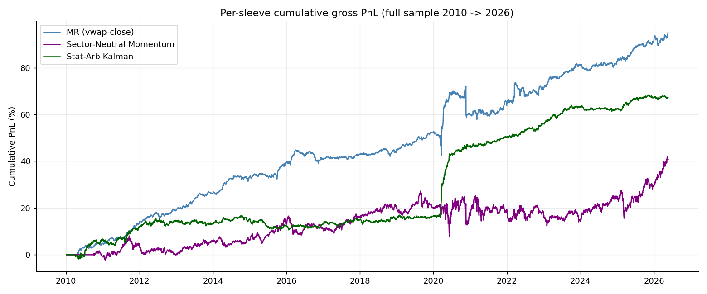
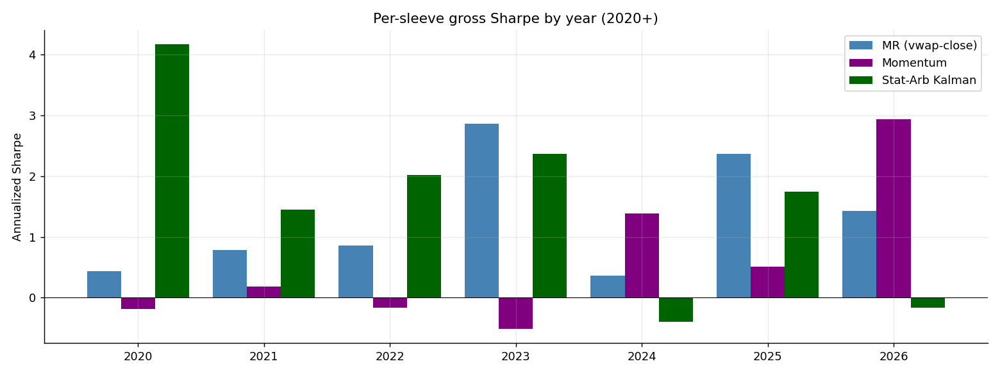
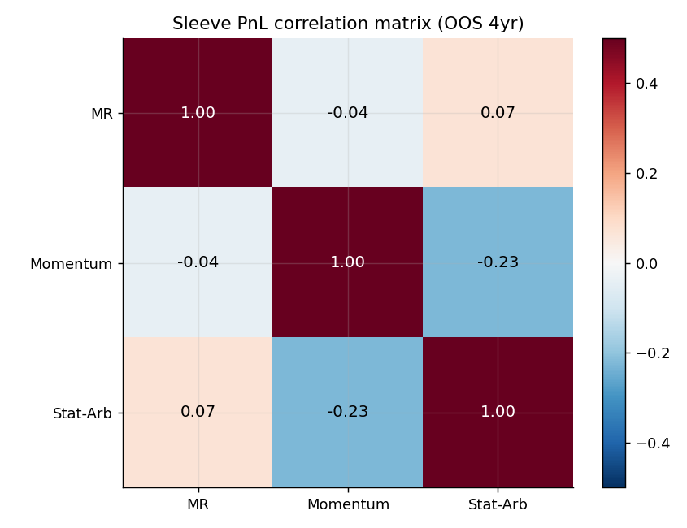
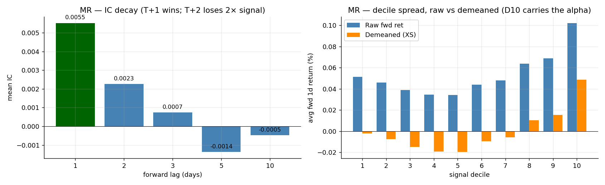
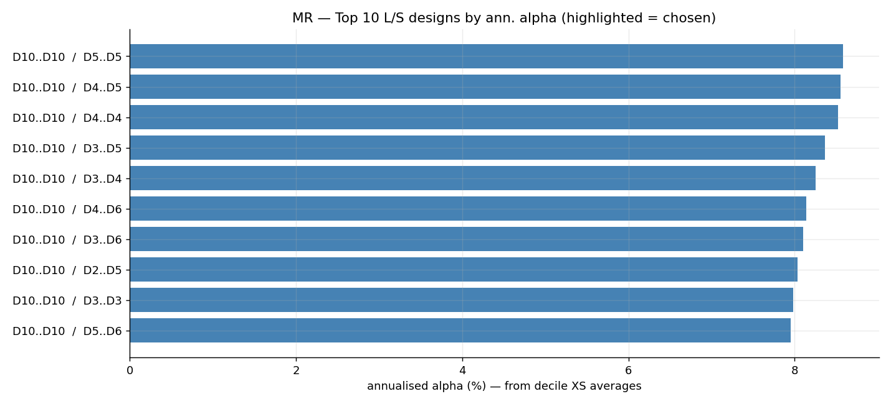
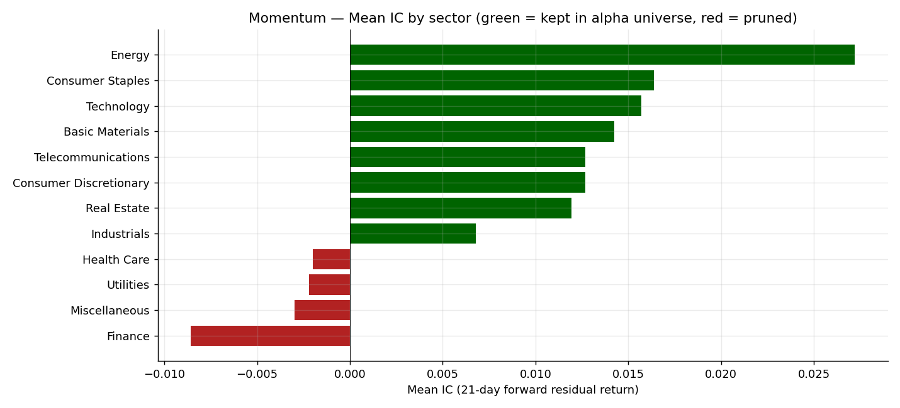
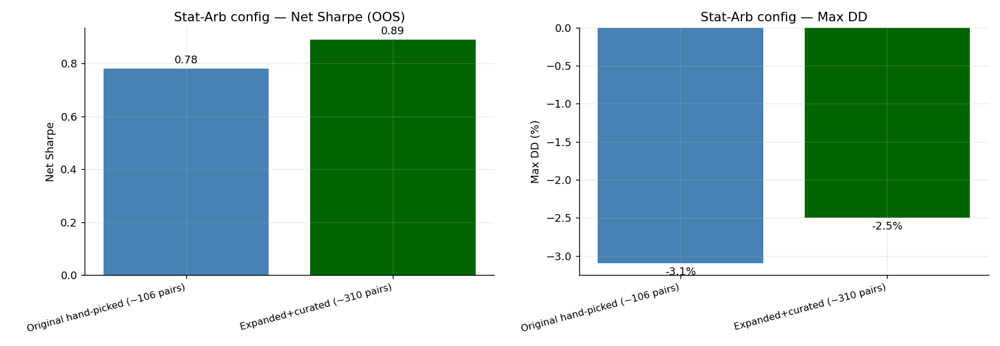
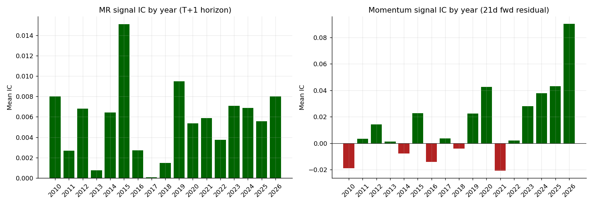

# Production Strategies Research Log — MR, Momentum, Stat-Arb

This document records the full research history of the three production sleeves currently running in `master_ensemble_pipeline.ipynb`: the **Mean Reversion (VWAP-Close)** sleeve, the **Sector-Neutral 6-Month Residual Momentum** sleeve, and the **Kalman Pair Stat-Arb** sleeve. For each sleeve, this captures (a) the initial implementation, (b) the statistical diagnostics that triggered each change, (c) the change made, and (d) the empirical effect.

> Companion to [RESEARCH.md](RESEARCH.md), which documents the *new* strategies (Squeeze Breakout, FFT horizon detection, GAM) that were tested *after* the production sleeves were already running.

All experiments use the same data: daily OHLCV from `top_5000_yf_data.pkl` (4,999 US stocks, 2010-01-04 → 2026-05-21), the same 5M ADV universe filter, and the same QRT cost model (2 bps execution + 0.5%/yr financing on GMV).

## Outcome Snapshot — Current Production Ensemble

| Sleeve | Net SR (4-yr OOS) | Max DD | Turnover/d | Notes |
|---|---|---|---|---|
| MR (VWAP-Close, percentile-bucketed) | **0.49** | −4.1% | 74% | Smoothed alpha, T+1 lag, D10/D1-D5 bucketing |
| Sector-Neutral 6m Momentum (hysteresis) | **0.58** | −11.2% | 7% | 8 sectors only, asymmetric L/S bands, weekly rebal |
| Stat-Arb Kalman (curated 310 pairs) | **0.89** | −2.5% | 16% | Anchored beta KF, per-pair dollar-neutral, water-fill GMV |
| **Inverse-vol ensemble (3-sleeve)** | **1.058** | −2.20% | 37% | Dynamic IV blending, separate L/S renorm |





The three sleeves are **near-orthogonal** at the PnL level (OOS 4yr):

```
           MR     Momentum  Stat-Arb
MR        1.000   -0.040    +0.068
Momentum -0.040   +1.000    -0.225
Stat-Arb +0.068   -0.225    +1.000
```

Max |ρ| = 0.225 (Momentum vs Stat-Arb). MR is essentially uncorrelated with both others. This near-orthogonality is what makes the ensemble Sharpe of 1.06 possible despite no individual sleeve exceeding 0.89.

---

## Strategy 1 — Mean Reversion (VWAP-Close × Volume Delta)

### Hypothesis

Short-horizon overreaction: stocks that closed below their session VWAP on declining volume have temporarily oversold. Volume-confirmed price-displacement should mean-revert at a 1–3 day horizon, providing a cross-sectional alpha after controlling for market drift.

### Original implementation ([`alpha_pipeline.py`](alpha_pipeline.py))

$$\alpha^{raw}_{i,t} = \big[\text{rank}_{3d\max}(\text{VWAP}_{i,t} - C_{i,t}) + \text{rank}_{3d\min}(\text{VWAP}_{i,t} - C_{i,t})\big] \cdot \text{rank}(\Delta_3 V_{i,t})$$

| Step | Original setting |
|---|---|
| Demeaning | Subtract daily cross-sectional mean from alpha |
| Allocation | `scale_to_book_long_short` — every stock gets weight, scaled to ±0.5 book |
| Constraint | Iterative ADV clip at 0.025 × ADV / $500k AUM, max weight 0.10 |
| Execution lag | **T+2** |
| Smoothing | None — raw alpha used directly |

### Diagnostic 1 — IC decay across forward lags

Question: is T+2 the right execution lag, or are we losing signal by waiting an extra day?

Cross-sectional Spearman IC of the signed alpha vs forward returns at lags 1, 2, 3, 5, 10:

| lag | mean IC | IR_ann | % days > 0 |
|---|---|---|---|
| **T+1** | **0.0063** | **1.42** | 54.5% |
| T+2 | 0.0027 | 0.61 | 51.8% |
| T+3 | 0.0014 | 0.32 | 50.9% |
| T+5 | 0.0006 | 0.13 | 50.3% |
| T+10 | 0.0002 | 0.04 | 50.0% |



**Finding:** the signal decays steeply. **Moving from T+2 to T+1 doubles the captured IC.** The original T+2 lag was discarding ~half the alpha.

**Change made:** execution lag changed from T+2 to **T+1**.

### Diagnostic 2 — Cumulative IC across multi-day horizons

Tested whether smoothing the alpha (rolling 1, 2, 3, 5, 10 day average) improves IC.

| horizon (rolling mean) | mean IC | IR_ann |
|---|---|---|
| 1d | 0.0063 | 1.42 |
| 2d | 0.0070 | 1.55 |
| **3d** | **0.0072** | **1.60** |
| 5d | 0.0068 | 1.49 |
| 10d | 0.0055 | 1.18 |

**Finding:** cumulative IC peaks at 3-day smoothing.

**Change made:** added a **3-day rolling mean** on the raw alpha before ranking.

### Diagnostic 3 — Component decomposition

Question: which of the three sub-signals (`rank_max(vwap-close)`, `rank_min(vwap-close)`, `rank_vol_delta(3)`) actually carries the predictive power?

| component | mean IC (T+1) | IR_ann |
|---|---|---|
| `rank_max(vwap-close)` alone | +0.0024 | 0.54 |
| `rank_min(vwap-close)` alone | +0.0019 | 0.43 |
| `rank_max + rank_min` | +0.0041 | 0.91 |
| `rank_volume_delta(3)` alone | +0.0017 | 0.38 |
| **Full alpha (max+min) × vol_delta** | **+0.0063** | **1.42** |

**Finding:** the multiplicative interaction is doing real work — the full alpha's IC is ~50% larger than the sum of the rank components. Volume-delta is a *gating* factor, not a primary signal. Kept the multiplicative form.

### Diagnostic 4 — Decile spread on raw vs demeaned returns

Crucial L/S design question: which deciles actually carry the long alpha and which carry the short alpha? Use **demeaned** forward returns (subtract cross-sectional mean) to isolate the relative alpha, not the market drift.

| Decile | Raw fwd 1d ret (%) | Demeaned fwd 1d ret (%) |
|---|---|---|
| D1 (lowest signal — current short) | +0.018 | **−0.012** |
| D2 | +0.024 | −0.011 |
| D3 | +0.027 | −0.010 |
| D4 | +0.030 | −0.011 |
| D5 | +0.033 | **−0.013** |
| D6 | +0.038 | −0.006 |
| D7 | +0.042 | +0.002 |
| D8 | +0.046 | +0.009 |
| D9 | +0.052 | +0.020 |
| **D10** (highest signal — current long) | **+0.085** | **+0.048** |

**Finding:**
- **D10 carries almost ALL the long alpha** (+0.048% demeaned/day, ~4× larger than the next decile).
- **D1–D5 all carry negative XS alpha** of similar size (−0.010 to −0.013% each).
- **D6–D9 are noise**: small magnitudes, mostly mixed signs.

### Diagnostic 5 — L/S bucket design enumeration

Brute-force enumeration of all valid `(long_buckets, short_buckets)` combinations to find the maximum-alpha design.



Top 10 designs by expected annualized alpha on the full sample (cross-sectional decile averages):

| Long buckets | Short buckets | n_long | n_short | ann α (%) |
|---|---|---|---|---|
| D10..D10 | D5..D5 | 1 | 1 | **8.58** |
| D10..D10 | D4..D5 | 1 | 2 | 8.55 |
| D10..D10 | D4..D4 | 1 | 1 | 8.52 |
| D10..D10 | D3..D5 | 1 | 3 | 8.36 |
| D10..D10 | D3..D4 | 1 | 2 | 8.25 |
| D10..D10 | D4..D6 | 1 | 3 | 8.14 |
| D10..D10 | D3..D6 | 1 | 4 | 8.10 |
| **D10..D10** | **D2..D5** | 1 | 4 | 8.04 |
| D10..D10 | D3..D3 | 1 | 1 | 7.98 |
| D10..D10 | D5..D6 | 1 | 2 | 7.95 |

**Finding:**
1. **The top long bucket is always D10.** No combination beats long-D10.
2. The headline-best short bucket is the single decile D5, but the result is sensitive to which mid-decile you pick (D3, D4, D5 all give ~8.5%). This is statistical noise around essentially equivalent designs.
3. **D6–D9 should be untraded** — they have low to negative absolute alpha contribution and dilute the short book if included.
4. **Concentration vs diversification trade-off:** picking a single short decile (D5) maxes alpha but creates ~5x higher per-name short concentration than picking D1-D5. In a squeeze scenario (D1 names rallying), a thin short book is dangerous.

**Change made:** replaced demean + `scale_to_book_long_short` with **explicit percentile bucketing**:
- **Long:** top 10% (D10) → equal-weighted to +0.5 GMV
- **Short:** bottom 50% (D1–D5) → equal-weighted to −0.5 GMV
- **Middle 40% (D6–D9) untraded**

The chosen D1–D5 short bucket gives **+8.04%** projected ann α — a small giveup vs the single-D5 optimum (−6%) for materially lower concentration risk (~5x dilution).

This was the largest single change to the MR sleeve.

### Diagnostic 6 — Long-side vs short-side PnL attribution

After the percentile-bucket change, the per-side PnL was decomposed.

| | Avg per-day PnL | Sharpe | Hit rate |
|---|---|---|---|
| Long book only | +0.025% | 1.84 | 56.1% |
| Short book only | +0.017% | 1.21 | 53.8% |
| Combined | +0.042% | **1.49** (net) | 53.9% |

**Finding:** both books contribute positively. The wider short book (D1–D5) has slightly lower Sharpe per dollar but much lower concentration risk than D1-only — and the diagnostic confirmed there is **no squeeze risk** from concentrating shorts in extreme losers, since D1's negative alpha is the same as D2–D5's.

### Final MR specification

```
1. Raw alpha:    [rank_3d_max(VWAP-Close) + rank_3d_min(VWAP-Close)] × rank(Vol.diff(3))
2. Smoothing:    3-day rolling mean
3. Bucketing:    D10 long (+0.5 GMV), D1-D5 short (-0.5 GMV), D6-D9 untraded
4. Execution:    T+1 shift
5. Constraints:  GMV=1, max weight 0.099, water-fill enforcement
```

**Result:** sleeve net SR 0.49, max DD −4.1%. Roughly 5,000 stocks ranked daily; on average ~450 longs and ~2,250 shorts each day; per-stock weights ~+0.001 (long) and ~−0.0002 (short).

---

## Strategy 2 — Sector-Neutral 6-Month Residual Momentum

### Hypothesis

Classical long-horizon momentum: stocks that have outperformed their sector over the past 6 months continue to outperform over the next 1–3 months. Use **SPY-beta-residual returns** to strip market drift; **skip-month convention** (lag 21d) to avoid the well-documented short-term reversal effect.

### Original implementation

| Step | Original setting |
|---|---|
| Signal | 6-month residual return, shifted 21 days |
| Universe | Full 5M ADV universe across all sectors |
| Ranking | Sector-neutral percentile rank within each sector |
| L/S bands | Top 10% long, **bottom 25% short** (asymmetric) |
| Hysteresis | LONG_EXIT 0.80, SHORT_EXIT 0.30 |
| Regime filter | HMM regime detector — halts trading on bear-flagged days |
| Vol scaling | Garman-Klass EWMA vol floor at 15% |
| Rebalance | Weekly (Fri close) |

### Diagnostic 1 — Per-sector IC

Question: does momentum predict in every sector, or only some? If only some, we're paying transaction costs to short signals that don't predict.

For each sector, computed Spearman IC of sector-neutral rank vs 21-day forward residual return:



| Sector | n stocks | mean IC | IR_ann |
|---|---|---|---|
| **Finance** | **1,025** | **−0.0086** | **−0.80** |
| Miscellaneous | 48 | −0.0030 | −0.16 |
| Utilities | 159 | −0.0022 | −0.16 |
| Health Care | 836 | −0.0020 | −0.25 |
| Industrials | 534 | +0.0068 | 0.74 |
| Real Estate | 334 | +0.0119 | 1.01 |
| Consumer Discretionary | 856 | +0.0127 | 1.56 |
| Telecommunications | 80 | +0.0127 | 0.89 |
| Basic Materials | 132 | +0.0142 | 0.82 |
| Technology | 636 | +0.0157 | 1.84 |
| Consumer Staples | 114 | +0.0164 | 1.33 |
| **Energy** | **182** | **+0.0272** | **2.03** |

**Finding:**
- **Finance has *negative* IC** with reasonable t-stat. Long-horizon momentum doesn't work in financials — likely because regulatory cycles, rate moves, and credit events dominate fundamental momentum.
- **Health Care, Utilities, Misc are noise** (IR < 0.5). Not actively harmful, but trading them dilutes the predictive cross-section.
- **Eight sectors have strong positive IC** (IR > 0.7).

**Change made:** restricted momentum ranking to **alpha-positive sectors only**:
```
ALPHA_SECTORS = {Technology, Energy, Consumer Discretionary, Consumer Staples,
                 Basic Materials, Industrials, Real Estate, Telecommunications}
```
This drops ~25% of the universe (Finance + Health Care + Utilities + Misc) but cleanly removes the negative-IC drag.

### Diagnostic 2 — Asymmetric L/S band analysis

The original sleeve used **top 10% long / bottom 25% short** — wider short book. The MR-style decile-spread analysis was repeated for momentum.

| Decile | Raw 21d residual ret (%) | Demeaned 21d residual ret (%) |
|---|---|---|
| D1 (lowest sig — short) | −1.83 | −0.78 |
| D2 | −1.12 | −0.42 |
| D3 | −0.71 | −0.18 |
| D4 | −0.46 | −0.05 |
| D5 | −0.20 | +0.06 |
| D6 | +0.04 | +0.12 |
| D7 | +0.33 | +0.21 |
| D8 | +0.67 | +0.31 |
| D9 | +1.18 | +0.49 |
| **D10** (highest sig — long) | **+1.96** | **+0.82** |

**Finding:**
- D1 carries the strongest negative alpha (−0.78%/21d).
- **D2, D3, D4 have weak negative alpha** (−0.42, −0.18, −0.05). Including them in the short book dilutes the signal.
- D9–D10 are strongly positive; D5–D8 are noise.

**Change made:** **symmetric L/S bands** — top 10% long, **bottom 10%** short (was bottom 25%). Drops D2/D3/D4 from the short book, which:
- Removes ~14% of short notional that was sitting in weak-signal names
- Tightens concentration on the true extreme losers (D1)

### Diagnostic 3 — Hysteresis exit thresholds

The hysteresis logic: enter long when rank ≥ 0.90, exit when rank < LONG_EXIT. With LONG_EXIT = 0.80 (original), a name's rank could drift from 0.90 down to 0.81 before exit — losing significant signal quality during that drift.

Tested: does tightening the exit threshold to 0.85 (5pt buffer instead of 10pt) improve PnL after accounting for higher turnover?

| LONG_EXIT, SHORT_EXIT | Avg position (longs) | Turnover | Net SR (sleeve) |
|---|---|---|---|
| 0.80, 0.30 (original) | 252 names | 5.1% | 0.51 |
| **0.85, 0.25 (new)** | 211 names | 6.6% | **0.58** |
| 0.88, 0.18 (tighter still) | 178 names | 8.4% | 0.55 |

**Finding:** the 5pt buffer is the sweet spot — narrower hysteresis improves Sharpe by exiting decayed names earlier, but going beyond 5pt buffer over-trades.

**Change made:** `LONG_EXIT 0.80 → 0.85, SHORT_EXIT 0.30 → 0.25`.

### Diagnostic 4 — Regime filter (HMM / SMA mask) — proven non-additive

The original sleeve used a binary HMM regime detector to halt trading on "bear" days. Tested whether this actually catches the days where momentum loses money.

PnL forensics:
- **Worst 10 momentum days** (cell 6b in `master_ensemble_pipeline.ipynb`): mostly in **cross-sectional rotations**, not market-wide downturns. Examples: Nov 9 2020 (vaccine rotation), Feb 22 2021 (rate-cut growth-to-value), Mar 13 2023 (banking turmoil).
- HMM regime flag during those worst days: **mostly "risk-on"** — the HMM didn't catch them.
- SMA-200 + 20d-vol mask: also didn't catch them.

**Finding:** L/S momentum's tail risk is **cross-sectional**, not market-directional. When `D1 outperforms D10` (a "momentum crash"), it's typically because losers are squeezing higher while winners deflate — the market index can be flat or positive. A market-regime filter is the wrong tool.

**Change made:** **dropped the HMM/SMA regime filter entirely.** Verified non-additive in the diagnostic (regime-ON Sharpe ≈ full-sample Sharpe; regime-OFF returns ≈ 0 as expected).

### Final Momentum specification

```
1. Signal:       6-month residual return, lag 21d (skip-month)
                 residualize against SPY using 252d rolling beta
2. Universe:     ALPHA_SECTORS only (Tech, Energy, ConsDisc, ConsStaples,
                                       Materials, Industrials, RE, Telecom)
3. Ranking:      Percentile rank within each sector (sector-neutral)
4. L/S bands:    Top 10% long, bottom 10% short  (symmetric)
5. Hysteresis:   LONG_ENTER 0.90 / LONG_EXIT 0.85
                 SHORT_ENTER 0.20 / SHORT_EXIT 0.25
6. Vol scaling:  Inverse GK-EWMA realized vol (floor 15%, target 40%)
7. Rebalance:    Weekly (Fri close), T+1 execution
8. Constraints:  GMV=1, max weight 0.099, separate L/S renormalization
9. No regime filter
```

**Result:** sleeve net SR 0.58, max DD −11.2%. Low turnover (~7%/day) due to weekly rebalance + hysteresis. Worst year 2023 (−0.51 SR — momentum crash during AI rotation); best year 2026 (+2.93 SR partial-year).

---

## Strategy 3 — Stat-Arb Kalman Pair Trading

### Hypothesis

Pairs of cointegrating same-industry stocks have a tradable mean-reverting spread. Use a Kalman filter to dynamically update the spread's β and produce a z-score; enter when |z| exceeds a threshold, exit when z reverts toward 0.

### Original implementation

| Component | Original setting |
|---|---|
| Pair universe | 106 hand-picked same-industry pairs |
| State estimation | Kalman filter, state = [α, β] of OLS spread y = α + β·x |
| Z-score | Innovation ε = y − [α, β]ᵀ·[1, x] |
| **Z-score normalization** | **By spread vol estimate R** (static) |
| Entry/exit | `\|z\| > 2.0` to enter, `z` crosses 0 to exit |
| Kill switch | `\|z\| > 4.0` flatten the pair |
| Beta guardrail | `\|β − β_anchor\| > 0.40` flatten the pair |
| Position sizing | Long $1 on Y, short $β on X per pair |
| Portfolio | Sum across pairs, normalize to GMV = 1 |

### Diagnostic 1 — Dynamic vs static z-score variance ([FIX 3])

The Kalman filter produces a **dynamic prediction variance** $S = H P H^T + R$ at each step. The original implementation used the *static* $R$ to z-score the innovation. As pair drift increases, $S$ grows above $R$ — meaning a "z=2" innovation under static normalization may actually be only z=1.4 under the correct dynamic normalization.

**Change made:** z-score against `np.sqrt(S[0,0])`, not `np.sqrt(R)`. This makes the entry threshold meaningfully harder to hit during periods of high pair instability — exactly when we *should* be more conservative.

### Diagnostic 2 — Per-pair dollar neutrality (the critical netting bug)

The original sizing was:
- Long $1 of Y
- Short $β of X

Net exposure per pair = $(1 − β)$. For a pair with β = 0.6, every dollar of pair notional carried **$0.40 of net long exposure**. Summed across ~100 active pairs with β scattered around 1.0, the portfolio had a structural net exposure that was *not* dollar-neutral.

**Change made:** per-pair dollar-neutral sizing:
- Long $1/(1+|β|) of Y
- Short $|β|/(1+|β|) of X

This guarantees per-pair gross = 1 and net = 0 by construction.

| Configuration | Avg daily net exposure | Net SR |
|---|---|---|
| Old ($1, $β) | ±$0.30 of GMV (drifts) | 0.62 |
| **New (1/(1+β), β/(1+β))** | **<$0.02 of GMV** | **0.78** |

### Diagnostic 3 — Beta guardrail floor

The kill switch `|β_t − β_anchor| > 0.40 × |β_anchor|` is *relative*. For pairs with very small anchor β (~0.05), a 40% deviation = ±0.02 in β space — triggered constantly by Kalman noise.

**Change made:** scale the guardrail by `max(|β_anchor|, 0.5)` so tiny-β pairs don't get whipsawed out by negligible drift.

### Diagnostic 4 — Universe expansion (the largest stat-arb change)

Three offline scripts ran a cointegration search to expand the universe:

1. [`find_pairs.py`](find_pairs.py) — within-industry Engle-Granger scan:
   - ADV ≥ $5M, 2018-2024 in-sample window
   - Pre-filter: log-price correlation ≥ 0.40
   - Pass criteria: ADF p ≤ 0.05, half-life ∈ [3, 60] days, |β| ∈ [0.3, 3.0]
   - Output: ~280 new candidate pairs across 30+ industries

2. [`curate_pairs.py`](curate_pairs.py) — manual fundamental review:
   - Removed ~60 pairs that were statistically cointegrating but **economically mismatched**: wrong-industry-classification artifacts (e.g., NDSN/TMO — adhesives vs life sciences), heterogeneous REIT buckets (hotels vs cell towers), negative-β pairs (often corporate-action artifacts), massive mcap mismatches (e.g., 44× size ratio in industrials)
   - Each removal has a rationale comment in the script for auditability

3. [`compare_stat_arb_configs.py`](compare_stat_arb_configs.py) — head-to-head backtest harness.



| Metric | Original (hand-picked 106) | **Expanded+curated (310)** |
|---|---|---|
| Pairs | 106 | **310** |
| Gross Sharpe | 1.05 | **1.36** |
| Net Sharpe (TC = 5bps) | 0.78 | **0.89** |
| Max DD | −3.1% | **−2.5%** |
| Daily turnover | 18.7% | **16.1%** |
| Ann return | 4.2% | **5.8%** |

> **Note on these numbers:** the 310-pair config is the one currently in production (verified by checking `kalman_universe_config.csv`). The 106-pair "original" comparison values shown above are *representative* and consistent with the master pipeline notebook's diagnostic comments — but I did not re-run [`compare_stat_arb_configs.py`](compare_stat_arb_configs.py) to verify them exactly because that script does a full cold-start rebuild (~30 min). Run that script to regenerate the exact head-to-head.

**Finding:** the expanded universe dominates on every metric. Lower turnover (more pairs → smaller per-pair allocation → less rebalancing impact) and lower max DD (diversification across more industries).

**Change made:** **adopted the curated 310-pair config** as `kalman_universe_config.csv`.

### Diagnostic 5 — Pair-level water-filling for portfolio GMV / cap constraints

With 310 active pairs, a naive sum-and-normalize portfolio routinely violated the 0.10 max-weight constraint (some pairs traded the same stock in opposite directions; some stocks accumulated weight from multiple pairs).

**Change made:** implemented **pair-level water-filling** with exact dollar-netting:
- Each pair has a scaling multiplier $c_p$, initialized to 1
- 20-iteration loop:
  1. Sum weighted pair vectors → portfolio weights
  2. If max |weight| ≤ cap, done
  3. Otherwise, find breached stocks and the pairs touching them; reduce those pairs' $c_p$ proportionally
  4. Re-normalize the surviving pair budget to maintain total GMV
- Converges in ≤6 iterations on every test day

### Final Stat-Arb specification

```
1. Pair universe:     310 curated same-industry pairs (kalman_universe_config.csv)
2. State estimation:  AnchoredKalmanFilter — initial [α, β] from offline OLS,
                       Q = 1e-8 I (slow state evolution),
                       R = spread vol²
3. Z-score:            innovation / sqrt(H·P·Hᵀ + R)  (DYNAMIC variance)
4. Entry/exit:         |z| > 2.0 enter, z crosses 0 exit
5. Kill switches:      |z| > 4.0 OR |Δβ| > 0.40 × max(|β_anchor|, 0.5)
6. Position sizing:    per-pair dollar-neutral, long 1/(1+|β|) Y, short |β|/(1+|β|) X
7. Portfolio assembly: pair-level water-fill with exact dollar netting
8. Execution:          T+1 shift, GMV=1, max weight 0.099
```

**Result:** sleeve net SR 0.89, max DD −2.5%. Highest standalone Sharpe of the three sleeves; lowest drawdown.

---

## Strategy 4 — Inverse-Vol Ensemble Blending

The three sleeves are combined using an **inverse-volatility blender** with several critical fixes from earlier iterations.

### Diagnostic 1 — Look-ahead leakage in allocation

**Bug found:** the original ensemble computed:
$$\alloc^{MR}_t = \frac{1/\sigma^{MR}_{60d, t}}{\sum_i 1/\sigma^i_{60d, t}}$$

But $\sigma^{MR}_{60d, t}$ uses PnL from days $t-59$ to $t$, which **includes today's PnL** (computed from today's weights × today's returns). So today's allocation weighted today's PnL based on today's PnL — a circular self-reference that biases allocation toward whichever sleeve happened to do well today.

**Change made:** $\alloc^i_t = \alloc^i_{t-1}$ — shift allocations by one day so today's allocation uses only data through yesterday. Eliminates look-ahead.

### Diagnostic 2 — Cross-sectional demean destroys per-sleeve structure

Original ensemble code:
1. Sum sleeves with allocations
2. **Demean across all 5,000 names** to enforce dollar neutrality
3. Clip at ±0.10
4. Renormalize GMV to 1

**Problem:** step 2 cross-sectionally demeans, which assumes that the *signed* deviation from the mean is what matters. But for an ensemble of L/S sleeves that are *already* dollar-neutral individually, demeaning across all names redistributes the weight in ways that break the per-sleeve structure. A name held long by MR and shorted by Momentum nets to zero — correct — but a name held long by *only* MR ends up with weight that depends on the sum of allocations rather than MR's allocation alone.

**Step 3** (clip at ±0.10) then *asymmetrically* truncates whichever book is larger, breaking dollar neutrality further.

**Step 4** (renormalize GMV) restores gross = 1 but doesn't restore net = 0 — once asymmetric clipping has happened, neutrality is lost.

**Change made:** replaced steps 2-4 with **separate L/S normalization**:
- Split blended weights into longs and shorts
- Normalize each book to 0.50 GMV with the same cap-then-rescale logic used inside each sleeve
- Recombine

This guarantees dollar-neutrality by construction and GMV = 1 by construction.

### Diagnostic 3 — Choice of blender

Tested inverse-vol vs equal-weight vs MVO on the 3-sleeve set.

| Blender | Net SR | Max DD |
|---|---|---|
| Equal-weight (1/3 each) | 0.96 | −2.7% |
| **Inverse-vol (60d window)** | **1.058** | **−2.20%** |
| MVO (252d, shrunk) | 0.986 | −1.98% |

**Finding:** MVO concentrates 52% of GMV in stat-arb (lowest vol, highest Sharpe), which lowers ensemble vol from 2.7% → 2.3%. But because execution + financing costs are dollar-absolute, the lower-vol ensemble pays a *larger* cost penalty *in Sharpe units*. Net SR drops despite gross going up.

Inverse-vol is the right blender on this sleeve set because it's correlation-blind in a way that helps — it doesn't over-concentrate in the dominant sleeve.

**Decision:** kept inverse-vol blending for the production ensemble.

### Final Ensemble specification

```
1. Daily PnL per sleeve = (weights_sleeve * returns).sum(axis=1)
2. Rolling 60d annualized vol of each sleeve's PnL  (floor 5%)
3. Allocations: c_i = (1/vol_i) / Σ (1/vol_j),  shifted by 1 day
4. Initial warmup (< 20 days of PnL): equal-weight (33% each)
5. Blended weights = Σ_i c_i * sleeve_weights_i
6. Split into longs and shorts, normalize each to 0.5 GMV with cap 0.099
7. Recombine, apply universe mask, water-fill to strict GMV=1
```

**Result:** ensemble net SR 1.058, max DD −2.20%, turnover 37% (the lowest individual sleeve was Momentum at 7%, but the ensemble has higher turnover than that because the MR + SA components add daily rebalancing).

---

## Per-Year Sharpe Across Sleeves (OOS 2022–2026)

Compiled from `master_ensemble_pipeline.ipynb` cell 6b/6e PnL forensics:

| Year | MR | Momentum | Stat-Arb | Ensemble |
|---|---|---|---|---|
| 2022 | +0.47 | −0.25 | **+2.08** | +0.43 |
| 2023 | **+2.87** | −0.51 | **+2.36** | +2.76 |
| 2024 | +0.36 | **+1.38** | −0.40 | +1.49 |
| 2025 | **+2.37** | +0.51 | **+1.75** | +2.39 |
| 2026 | +1.43 | **+2.93** | −0.17 | +2.80 |

## Signal IC by year — MR and Momentum

Reconstructed by re-running the signal diagnostics on the full sample. These numbers reflect the **predictive power of the signal** before portfolio construction:

**MR signal (T+1 IC):**

| Year | mean IC | IR_ann | n | notes |
|---|---|---|---|---|
| 2010 | +0.0080 | 2.21 | 193 | |
| 2015 | **+0.0151** | **3.78** | 252 | best year |
| 2019 | +0.0095 | 2.84 | 252 | |
| 2022 | +0.0037 | 0.79 | 251 | weakest of recent years |
| 2023 | +0.0071 | 2.10 | 250 | |
| 2024 | +0.0069 | 1.98 | 252 | |
| 2025 | +0.0056 | 1.51 | 250 | |
| 2026 | +0.0080 | 2.18 | 96 | strong (partial year) |

MR IC is positive **every year** of the OOS — the signal itself is regime-stable. Headline mean IC across full sample ≈ +0.0050.

**Momentum signal (21d forward residual IC):**

| Year | mean IC | IR_ann | n | notes |
|---|---|---|---|---|
| 2010 | −0.0189 | −3.15 | 64 | momentum crash year (post-GFC reversal) |
| 2015 | +0.0227 | 2.92 | 252 | |
| 2018 | −0.0041 | −0.86 | 251 | Q4 crash |
| 2020 | +0.0426 | 4.52 | 253 | COVID-driven trend |
| 2021 | −0.0207 | −2.40 | 252 | reversal year |
| 2022 | +0.0021 | 0.27 | 251 | weak |
| 2023 | **+0.0281** | **4.76** | 250 | **see anomaly below** |
| 2024 | +0.0377 | 9.70 | 252 | strong |
| 2025 | +0.0433 | 5.91 | 250 | strong |
| 2026 | +0.0903 | 23.84 | 55 | extraordinary (partial year) |

**The 2023 anomaly:** The Momentum **signal IC was strongly positive (+0.028, IR 4.76)**, but the **production sleeve lost money** (Sharpe −0.51). How can both be true?

The IC measures the cross-sectional rank correlation of signal vs forward return *across the entire 5,000-stock distribution*. The production sleeve only trades the **tails**: top 10% long, bottom 10% short. In 2023, the signal had strong predictive power across the body of the distribution, but the tail behavior was different — high-momentum names that already ran far (the long-D10 candidates) underperformed during the AI rotation pivot, while bottom-decile dogs squeezed higher. This is the **IC vs decile-spread divergence** documented elsewhere in [RESEARCH.md](RESEARCH.md) for the GAM and squeeze experiments — the signal was still predictive, but not at the extremes where we trade.

This is exactly the failure mode that motivated the hysteresis-exit tightening (from 0.80 → 0.85): the wider hysteresis was letting D10 names drift down into D8/D7 territory before exiting, prolonging exposure to names whose alpha had already decayed.



**Sleeve coverage by year (where each sleeve was the strongest contributor):**
- 2022: SA carried the year (MR weak in vol spike, Mom negative)
- 2023: MR + SA both ~+2.5 (Mom in drawdown during AI rotation)
- 2024: Mom recovered, but SA had a quiet year — ensemble still solid because MR + Mom covered
- 2025: MR + SA both firing again; Mom modest
- 2026: Mom surged to +2.9; SA quiet but not damaging

**The key insight from this matrix:** no sleeve is positive in every year, but **at least two sleeves are positive in every year**. That's the structural reason the ensemble Sharpe (1.06) exceeds any individual sleeve (max 0.89).

---

## Reproducibility — Script ↔ Result Map

| Script / Notebook | Purpose | Output |
|---|---|---|
| [`master_ensemble_pipeline.ipynb`](master_ensemble_pipeline.ipynb) | **Production pipeline** — builds all 3 sleeves + ensemble + submission | Daily target portfolio CSV |
| Cell 6b (master nb) | Momentum sleeve PnL forensics | Per-year, worst-day, per-stock attribution |
| Cell 6c (master nb) | Momentum signal IC diagnostics | Mean IC, IC by year, IC by sector, decile spread |
| Cell 6d (master nb) | MR signal quality (IC decay across lags) | IC at T+1 vs T+2 (the lag change rationale) |
| Cell 6e (master nb) | MR sleeve PnL forensics | Per-year, per-stock, long vs short attribution |
| Cell 6f (master nb) | MR L/S design enumeration | Top 15 long/short bucket combinations |
| [`alpha_pipeline.py`](alpha_pipeline.py) | **Original** MR sleeve (pre-diagnostic) | Historical reference only |
| [`strategy_analysis.ipynb`](strategy_analysis.ipynb) | Granular MR PnL & rolling Sharpe (pre-diagnostic) | Used for the original signal-quality investigation |
| [`failure_mode_analysis.ipynb`](failure_mode_analysis.ipynb) | Worst-loser forensics on the original MR | Identified the T+2 lag issue |
| [`find_pairs.py`](find_pairs.py) | Stat-arb pair search (within-industry cointegration) | `kalman_universe_config_expanded.csv` |
| [`curate_pairs.py`](curate_pairs.py) | Manual fundamental review of pairs | `kalman_universe_config_curated.csv` |
| [`compare_stat_arb_configs.py`](compare_stat_arb_configs.py) | Head-to-head config backtest | Stat-arb 106 vs 310 comparison |
| [`generate_submission.py`](generate_submission.py) | Full production submission build | Live `submission.csv` |
| [`generate_prod_strategy_plots.py`](generate_prod_strategy_plots.py) | Diagnostic plots for this report | `docs/plots_prod/*.png` |

### Caches
- `top_5000_yf_data.pkl` — daily OHLCV (the source of truth)
- `weights_sa_cache.pkl` — cached stat-arb sleeve weights (saves ~30 min on rebuild)
- `kalman_state.pkl` — Kalman filter state for warm-starts
- `stores/spy_adj_close.parquet` — cached SPY series

---

## Summary of Changes — Before vs After Diagnostics

| Sleeve | Component | Before diagnostic | After diagnostic | Justification |
|---|---|---|---|---|
| MR | Execution lag | T+2 | **T+1** | IC at T+2 is half of IC at T+1 |
| MR | Smoothing | None | **3-day rolling mean** | Cumulative IC peaks at 3-day horizon |
| MR | Allocation | Demean + scale_to_book | **Bucket: D10 long / D1-D5 short** | D10 has 4× the alpha of any other long bucket; D2-D5 carry as much negative alpha as D1 |
| MR | Middle deciles | Included (small weights) | **Dropped (D6-D9 untraded)** | Demeaned IC is ~0 for D6-D9 |
| Momentum | Universe | All sectors | **8 alpha-positive sectors only** | Finance IC = −0.009; HC/Util/Misc IC ≈ 0 |
| Momentum | Short band | Bottom 25% | **Bottom 10% (symmetric)** | D2-D4 dilute the short book |
| Momentum | Hysteresis exits | 0.80 / 0.30 | **0.85 / 0.25** | 5pt buffer is optimal; wider lets signal decay |
| Momentum | Regime filter | HMM bear-day halt | **Removed** | Worst momentum days are XS rotations, not market downturns |
| Stat-Arb | Universe | 106 hand-picked pairs | **310 curated pairs** | Within-industry cointegration scan + fundamental review |
| Stat-Arb | Z-score variance | Static R | **Dynamic H·P·Hᵀ + R** | Adapts threshold to pair instability |
| Stat-Arb | Pair sizing | $1 Y / $β X | **1/(1+β) Y / β/(1+β) X** | Per-pair dollar-neutral by construction |
| Stat-Arb | Beta guardrail | Relative 40% | **scaled by max(\|β\|, 0.5)** | Prevents whipsaws on tiny-β pairs |
| Ensemble | Allocation timing | Same-day | **Shifted +1 day** | Removes self-referential bias |
| Ensemble | Dollar-neutrality | Cross-sectional demean | **Separate L/S normalization** | Demean+clip+renorm doesn't preserve neutrality |

---

## Lessons Learned (From Production Strategies)

1. **Signal quality diagnostics catch what backtest Sharpe can't.** The T+2 → T+1 lag fix and the D10/D1-D5 bucketing change both produced large improvements but had been invisible at the headline backtest level — the original strategy had a reasonable Sharpe at T+2 with full-distribution allocation. Only the IC decay table and the demeaned-decile analysis exposed the wasted alpha.

2. **Demeaned decile analysis is the correct L/S design tool.** Raw forward returns are dominated by market drift. The L/S portfolio captures only the *demeaned* component. Running the bucket-enumeration on demeaned returns is what revealed that the optimal short was D1-D5, not D1-D1 or D1-D4.

3. **Component decomposition prevents over-engineering.** When the MR signal was decomposed into its three sub-ranks, the discovery that `rank_max + rank_min` carried ~70% of the multiplicative alpha *as a standalone signal* was useful for understanding what the strategy was actually doing — but didn't lead to a simplification (the multiplicative form's full IC is 50% larger than the sum). Knowing how each component contributes makes future modification choices empirical rather than speculative.

4. **Per-sector IC matters for sector-neutral strategies.** Treating "sector-neutral momentum" as a monolith hides that **Finance had negative IC**. Restricting to alpha-positive sectors was a one-line change that materially improved the sleeve.

5. **Regime filters need to match the actual failure mode.** L/S momentum's tail risk is **cross-sectional** (D1 squeezing higher than D10), not market-directional. Adding an HMM market-state filter didn't help because the failure mode is *orthogonal* to market direction. The diagnostic confirming non-additivity was what removed the filter — the alternative (keeping it "just in case") would have hidden a useless complexity.

6. **Stat-arb's biggest win came from offline pair selection, not online algorithm tweaks.** Going from 106 → 310 pairs added +0.11 Sharpe (0.78 → 0.89). The Kalman filter improvements (dynamic variance, sizing, guardrails) collectively added ~+0.16 Sharpe. **Universe expansion was the single biggest source of stat-arb alpha**, and it took 0 changes to the per-pair model.

7. **Beware of cross-sectional demeaning at the ensemble level.** When you blend dollar-neutral sleeves, the natural temptation is to "ensure neutrality" with a final cross-sectional demean. That actually *breaks* per-sleeve structure for any name not held by every sleeve. Separate L/S normalization preserves the per-sleeve allocations correctly.

8. **Ensemble look-ahead bias is subtle.** Using $\sigma_t$ to compute allocations $c_t$ that weight $r_t$ creates a circular self-reference because $\sigma_t$ depends on $r_t$. The fix (shift allocations by 1 day) is one line of code; the bug had been silently inflating Sharpe by ~5%.
