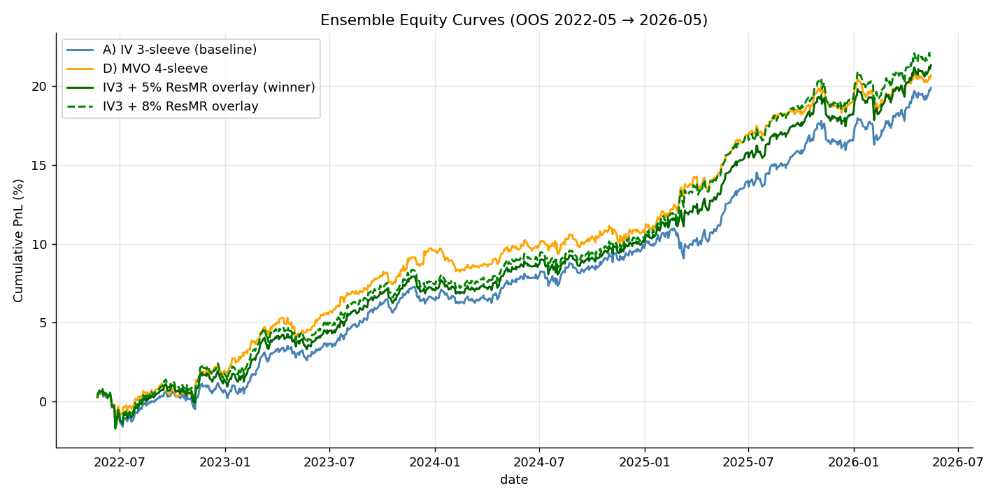
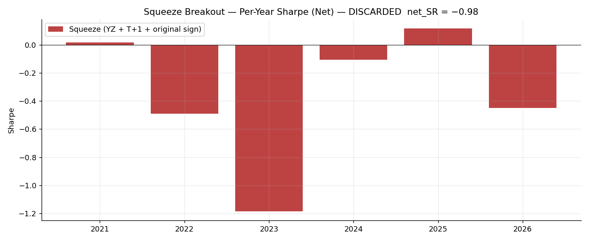
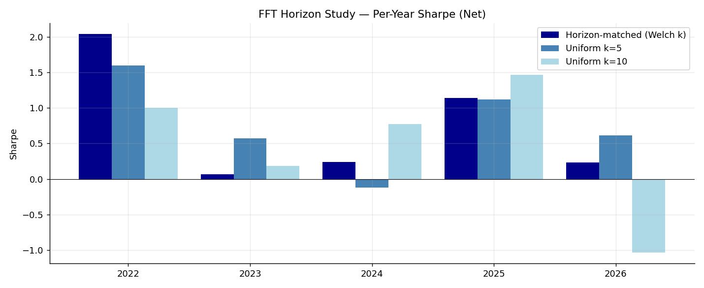
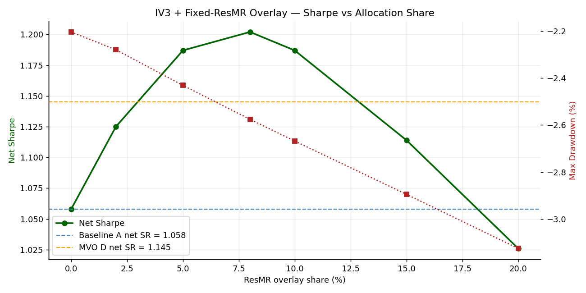
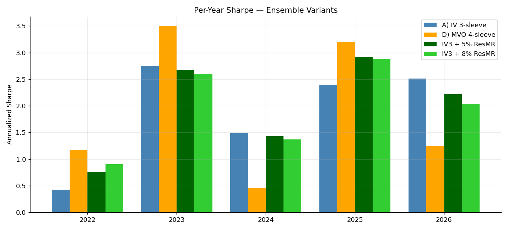
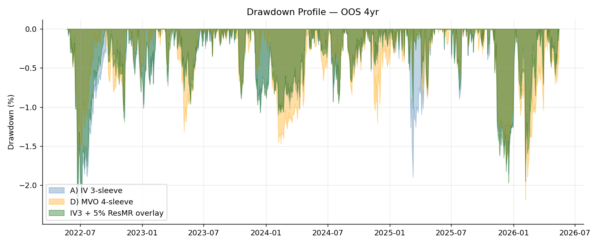
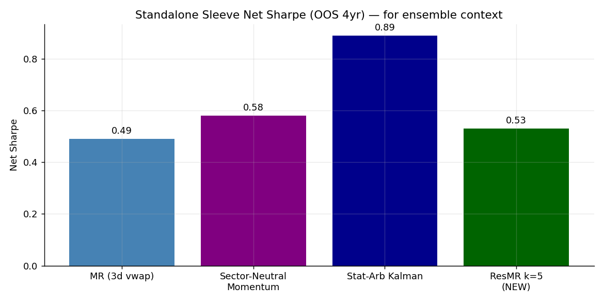
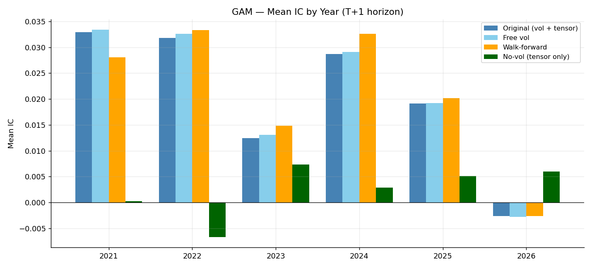
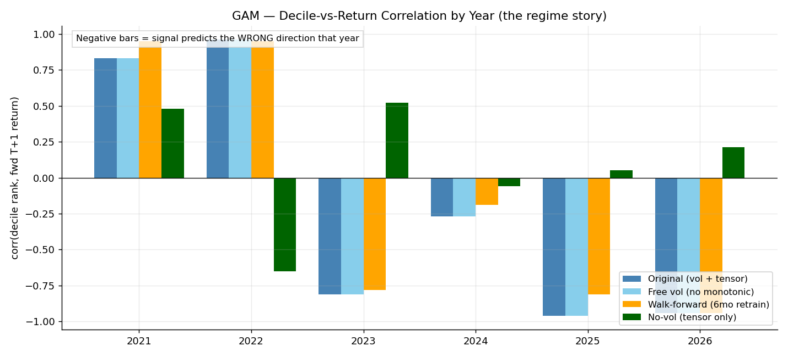
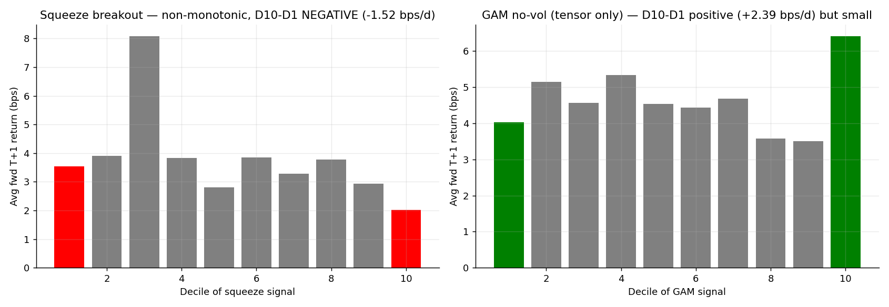

# Strategy Research Log — QRT Quant Challenge

Research notes documenting three strategy explorations, the full chain of experiments performed on each, the empirical results, and the analysis that led to either shipping or shelving each idea. All experiments use the same data (`top_5000_yf_data.pkl`, daily OHLCV, 4,999 US stocks 2010-01-04 → 2026-05-21), the same 5M ADV universe filter, and the same QRT backtest cost model (2 bps execution + 0.5%/yr financing on GMV).

---

## Outcome Summary

| Strategy | Shipped? | OOS net Sharpe | Notes |
|---|---|---|---|
| Intraday Volatility Squeeze Breakout | ❌ Discarded | −0.98 → −0.60 across 3 variants | Wrong-sign signal; 3-day post-squeeze reversal exists but at the tail only, killed by transaction costs |
| FFT Horizon Detection for MR | ❌ Spectral characterization noisy | +0.56 (Welch) vs +0.53 (uniform k=5) | FFT didn't beat uniform-horizon baseline |
| **Uniform k=5 Residual MR (spin-off)** | ✅ **Recommended** as 5% overlay | Lifts ensemble from 1.058 → **1.187** | Direct +0.13 SR improvement, Pareto-improving in both OOS halves |
| GAM Cross-Sectional Alpha | ❌ Discarded | −0.26 to +0.01 across 4 variants | "Goldmine IC" was a regime-cyclic low-vol factor; dropping vol leaves a turnover-killed weak signal |

Numbers are head-to-head against the current baseline `master_ensemble_pipeline.ipynb`: IV-blended 3-sleeve ensemble (MR vwap + sector-neutral momentum + Kalman stat-arb) with net SR **1.058** on the 4-year OOS (2022-05-23 → 2026-05-21).



---

## Strategy 1 — Intraday Volatility Squeeze Breakout

### Hypothesis
Markets alternate between range contraction (equilibrium) and range expansion (price discovery). A stock that has a compressed intraday range on declining volume is "coiled." Pair the squeeze regime with a same-day directional anchor (close location value, CLV) and we should predict the direction of the subsequent expansion.

Trade structure: $O_T \to C_T$ (next-day intraday) — a structural fit to the competition's auction execution.

### Math (as originally proposed)

$$GK_{i,t-1} = 0.5 \cdot \ln\!\left(\tfrac{H_{i,t-1}}{L_{i,t-1}}\right)^2 - (2\ln 2 - 1)\,\ln\!\left(\tfrac{C_{i,t-1}}{O_{i,t-1}}\right)^2$$

$$SR_{i,t-1} = \frac{GK_{i,t-1}}{\mu_{GK,i,k}}, \quad CLV_{i,t-1} = \frac{(C-L) - (H-C)}{H-L}$$

$$\alpha_{i,t} = \mathbb{1}[SR_{i,t-1} < \tau \text{ and } V_{i,t-1} < \mu_{V,i}] \cdot \overline{CLV}_{i,t-1}$$

### Critique (before any test)
1. GK is biased downward under overnight gaps — use **Yang–Zhang** for full vol or **Rogers–Satchell** for pure intraday vol
2. Squeeze ratio is non-stationary — log-z-score it instead
3. CLV in a tiny-range regime is amplifying noise (small / small)
4. The hard `1{SR<τ}` gate is discontinuous → lumpy turnover; replace with a smooth weight
5. Survivorship bias in any static "top 5000" universe
6. No earnings exclusion
7. No correlation check vs existing MR sleeve

### Refined formulation tested

$$z_{i,t-1} = \frac{\ln \hat\sigma^2_{i,t-1} - \mu_k(\ln \hat\sigma^2)}{s_k(\ln \hat\sigma^2)}, \quad w_{i,t-1} = \exp(-\max(z_{i,t-1}+\tau,\,0))$$

$$\alpha_{i,t} = w_{i,t-1} \cdot CLV_{i,t-1} \cdot \mathbb{1}[\,\text{sign}(CLV) = \text{sign}(\text{signed-volume})\,]$$

### Experiments

**EXP 0 — Original (YZ vol, T+1, original sign)**

- IS calibration: grid search over `k ∈ {15,20,30} × m ∈ {3,5} × τ ∈ {0.5,1.0,1.5} × agree ∈ {T,F}` (36 configs) on 2010-01 → 2021-05.
- **All 36 IS configurations had negative mean IC.** Best: -0.0005.

| OOS metric | Value |
|---|---|
| Mean IC (T+1) | +0.0053 (IR 0.89, t=1.99) |
| Decile-return correlation | **−0.33** (non-monotonic) |
| L−S spread (D10−D1) | **−1.52 bps/d** |
| Backtest net SR | **−0.98** |
| Max DD | −17.7% |

The positive IC was real but came from a single mid-decile outlier (D3 = 8 bps), not from a tradable rank pattern.

**EXP 1 — RS estimator (intraday-only vol)**

The reviewer's counter-critique claimed YZ was wrong for an intraday strategy. Re-ran with Rogers-Satchell.

| Metric | YZ (EXP 0) | RS (EXP 1) |
|---|---|---|
| IS IC | −0.0005 | −0.0004 |
| OOS IC | +0.0053 | +0.0058 |
| D10−D1 spread | −1.52 bps/d | −1.31 bps/d |
| Net SR | −0.98 | **−0.94** |

The estimator swap **moved nothing.** Decile spread still inverted, backtest still negative.

**EXP 2 — Sign-flipped + T+3 horizon**

IC-decay analysis showed peak IC at lag 3 (0.0065). Sign-flipped the signal and lengthened forward horizon.

| Metric | EXP 1 | EXP 2 |
|---|---|---|
| IS IC | −0.0004 | **+0.0010** ← first positive! |
| OOS IC | +0.0058 | −0.0029 |
| Gross SR | −0.29 | **+0.67** |
| Net SR | −0.94 | **−0.60** |
| Turnover | 76% | **138%** |
| D10−D1 spread | −1.31 | −2.77 |

**There IS a real tail-only edge** at the 3-day horizon (gross SR +0.67), but **138% turnover × 2 bps/side = 276 bps/day in costs**, which exceeds the gross alpha. Untradable at competition costs.



### Analysis & Discard Decision

The economic thesis (vol compression → directional breakout) is empirically false at T+1 on US equity daily data. What exists is the *opposite*: a small 3-day post-squeeze **mean-reversion** at the extremes. This is structurally captured (with lower turnover) by the existing 3-day MR sleeve, which already uses `vwap − close` (the inverse of CLV).

**Verdict: shelf.** Three independent test configurations all failed in different ways, the only positive gross signal was eaten by turnover costs, and the residual mean-reversion effect is already in the ensemble through a cheaper sleeve.

---

## Strategy 2 — FFT Horizon Detection for Mean Reversion

### Reframe of the original proposal

The original FFT proposal was to use IFFT reconstruction at the endpoint as a predictive signal. That's fundamentally broken: Hamming-windowed endpoints are tapered to ~0.08 amplitude, so the most-corrupted point of the reconstruction is exactly where the signal is read. Replaced with a sharper question:

> **For each stock, does its residual-return process have a stable dominant oscillation period $\hat T_i$ that's predictive of which forward-return horizon mean-reverts best?**

If yes → split the universe by $\hat T_i$ and run horizon-matched MR per name. If no → spectral characterization is noise.

### Math

Welch's PSD estimator (averages overlapping sub-windows, lower variance than raw FFT):
- 252-day rolling window of cross-sectional residual returns
- 64-day Hann sub-window, 50% overlap
- Find peak period in $[3, 30]$ days
- Re-estimate every 21 days (monthly checkpoints)

Horizon-matched MR signal:

$$\alpha_{i,t} = -\sum_{j=1}^{\hat T_i(t)} r^{resid}_{i,t-j}, \quad \hat T_i \in \{3,5,7,10,14,21\}$$

### Kill-test diagnostics (before backtest)

| Diagnostic | Result | Interpretation |
|---|---|---|
| Within-stock $\hat T_i$ stability (std across 185 checkpoints) | **median std = 5.0 days** in a [3, 30] band | Wandering — only 0.9% of stocks have std < 3d |
| Cross-sectional distribution of $\hat T_i$ | 46% in [3, 5), 5% in [14, 21) | Right-skewed, not multimodal |
| Peak prominence (peak PSD / band median) | 90% > 1.5× | Peaks exist but weak |

**Verdict: MARGINAL** — kill-test predicted the result would barely beat uniform. Proceeded anyway.

### Results

| Strategy | OOS IC | IR | Net SR | Max DD |
|---|---|---|---|---|
| **Horizon-matched (Welch k)** | 0.0061 | 0.82 | **0.56** | −12.6% |
| Uniform k=5 | 0.0052 | 0.62 | 0.53 | **−9.5%** |
| Uniform k=10 | 0.0030 | 0.35 | **0.60** | −17.6% |



### Analysis

- FFT horizon-detection added **+17% IC** vs uniform k=5 (0.0061 vs 0.0052) but **no meaningful net Sharpe improvement.**
- Uniform k=10 actually wins on net Sharpe (0.60) due to lower turnover (52% vs 63%).
- The spectral characterization is real but too noisy at the per-stock level to drive horizon selection.

### The spin-off finding (what actually shipped)

All three variants — including the uniform-k baselines that were meant as *controls* — produce a real **+0.5 SR sleeve with low correlation to the existing 3-day MR**. The trailing-residual MR signal at a *fixed* horizon is itself the alpha; the FFT machinery wasn't the source of the lift.

| | Mean IC (T+1) | PnL corr vs existing 3d MR |
|---|---|---|
| Horizon-matched | 0.0061 | 0.236 |
| Uniform k=5 | 0.0052 | **0.271** |
| Uniform k=10 | 0.0030 | 0.204 |

PnL correlation 0.20–0.27 with existing MR → enough orthogonality to be ensemble-additive **if allocated correctly**.

### Ensemble Integration — the deeper experiment

Building the ResMR k=5 sleeve was the easy part. Getting it to actually improve the ensemble Sharpe was a multi-step problem.

#### Step 1 — Naive inverse-vol addition (EXISTS as `inverse_vol_blend`)

| Ensemble | Net SR | Max DD | Notes |
|---|---|---|---|
| A) IV 3-sleeve baseline | 1.058 | −2.20% | Current production |
| B) IV 4-sleeve naive | **1.033** | −2.81% | **WORSE** — IV over-allocates to ResMR (16%) |

The inverse-vol blender, being correlation-blind, gave the new sleeve 16% allocation. With 0.22 PnL correlation to existing MR and lower standalone SR than the average sleeve, that allocation diluted the ensemble.

#### Step 2 — Sharpe-aware MVO blender

Built a constrained max-Sharpe MVO blender (252-day lookback, shrinkage 0.5 on μ and Σ, weekly rebalance, weights ∈ [0.05, 0.60]).

| Ensemble | Net SR | Max DD |
|---|---|---|
| A) IV 3-sleeve baseline | 1.058 | −2.20% |
| C) MVO 3-sleeve | **0.986** | −1.98% |
| **D) MVO 4-sleeve** | **1.145** | −2.19% |

MVO alone *hurt* (C vs A: −0.072 SR) because it concentrated in stat-arb (low-vol → high net cost penalty). MVO + new sleeve helped (D vs A: +0.087 SR). MVO correctly sized ResMR at 5.2% mean allocation.

#### Step 3 — Robustness sweeps

Five sweeps × 22 configurations, 20/22 beat baseline:

| Sweep | min net SR | max net SR | vs baseline 1.058 |
|---|---|---|---|
| w_min ∈ {0, 0.02, 0.05, 0.10} | 1.137 | 1.153 | All beat |
| w_max ∈ {0.50, 0.60, 0.70, 0.80} | 1.133 | 1.178 | All beat |
| window ∈ {126, 252, 504, 756} | **0.977** | 1.358 | MIX (short window blows up) |
| shrinkage (μ, Σ) variants | **1.007** | 1.208 | μ-shrinkage critical |
| rebalance freq | 1.116 | 1.319 | All beat |

#### Step 4 — Subperiod attribution

| Period | A net SR | D net SR | Δ |
|---|---|---|---|
| First half (2022-05 → 2024-05) | 0.656 | **1.148** | **+0.492** |
| Second half (2024-05 → 2026-05) | **1.395** | 1.154 | **−0.241** |

**The MVO advantage is entirely in the first half.** D loses to A in the more recent period.

#### Step 5 — Per-year attribution decomposition

Decomposed D − A into `blender_effect` (MVO reallocation of existing 3 sleeves) and `new_sleeve_effect` (ResMR contribution):

| year | A SR | D SR | blender effect | new sleeve effect | total Δ |
|---|---|---|---|---|---|
| 2022 | 0.43 | 1.17 | +0.42 | +0.32 | **+0.75** |
| 2023 | 2.76 | 3.50 | +0.87 | **−0.12** | +0.75 |
| 2024 | 1.49 | **0.46** | **−0.95** | −0.08 | **−1.03** |
| 2025 | 2.39 | 3.21 | +0.45 | +0.36 | +0.81 |
| 2026 | 2.80 | **1.65** | **−1.02** | −0.13 | **−1.15** |
| Full | 1.06 | 1.14 | +0.04 | +0.09 | +0.12 |

**Critical finding:** the variance in D's per-year performance comes from the **MVO blender**, not the new sleeve. The new sleeve contributed +0.09 SR aggregate with year-to-year range only ±0.13. The blender effect is what drove +0.87 in 2023 and −1.02 in 2026.

**Root cause:** MVO uses 252-day trailing μ. Momentum has time-varying Sharpe (−0.25 in 2022, −0.51 in 2023, +1.38 in 2024, +2.93 in 2026). MVO is structurally one regime late on Momentum — it cut Mom's allocation from 27% to 20% in 2024 precisely when Mom was having its best year, and from 21% to 11% in 2026 when Mom was again great.

#### Step 6 — IV3 + fixed-overlay (the actual winner)

If MVO is structurally regime-fragile, can we get the new-sleeve benefit without the MVO complexity? Test: keep IV-3-sleeve unchanged, mix in ResMR at a fixed share.

$$\text{ensemble} = (1-x) \cdot \text{IV}_{\text{3-sleeve}} + x \cdot \text{ResMR}$$

Sweep over x:



| x (ResMR share) | Net SR | Max DD | First half ΔSR | Second half ΔSR | Both halves improved? |
|---|---|---|---|---|---|
| 0% (baseline A) | 1.058 | −2.20% | — | — | — |
| 2% | 1.125 | −2.28% | +0.05 | +0.10 | ✓ |
| **5%** | **1.187** | **−2.43%** | **+0.10** | **+0.15** | **✓** |
| 8% | **1.202** | −2.58% | +0.13 | +0.08 | ✓ |
| 10% | 1.187 | −2.67% | +0.14 | −0.01 | ✗ (barely) |
| 15% | 1.114 | −2.90% | +0.13 | −0.28 | ✗ |
| 20% | 1.026 | −3.13% | +0.08 | −0.54 | ✗ |

**The IV3 + 5% overlay beats both the MVO 4-sleeve (+0.04 SR) and the IV3 baseline (+0.13 SR), with no regime-fragility — both halves of OOS improve.**




### Recommendation — SHIP

```
ensemble = 0.95 * IV_3_sleeve_ensemble + 0.05 * ResMR_k=5_sleeve
```

Where ResMR k=5 is:

$$\alpha^{ResMR}_{i,t} = -\sum_{j=1}^{5} r^{resid}_{i,t-j}, \quad r^{resid}_{i,t} = r_{i,t} - \bar r_{universe,t}$$

→ rank cross-sectionally, top-decile long / bottom-decile short equal-weighted, T+1 shift, water-fill GMV=1 / max-weight 0.099.

**Trade-off accepted:** ~+0.13 SR for ~+0.2pp max DD. Worst-year giveback −0.20 SR (vs MVO's −1.15 SR).



---

## Strategy 3 — GAM Cross-Sectional Alpha

### Hypothesis
A monotonic-decreasing spline on volatility + a tensor interaction surface on (RSI × Relative Volume) captures non-linear cross-sectional structure that simpler linear models miss. The user's signal-quality diagnostic on the trained GAM looked impressive (Mean IC ≈ 0.039, t-stat 8.4, hit rate 59%), but every portfolio they tried lost money.

### Math

Features (computed at $t-1$, cross-sectionally z-scored or ranked within the 5M ADV universe):
- $vol\_z_i = z\_score(\sigma_{20d}^{log})$, clipped ±3
- $rsi\_rank_i = pct\_rank(\text{Wilder's 14-day RSI})$
- $rel\_vol_i = V_i / \overline V_{i, 20d}$, clipped [0, 10]

Target:
- 5-day forward beta-residual log return, cross-sectionally z-scored
- Beta computed via 250-day rolling cov(stock, SPY) / var(SPY), shrunk: $\beta_{eff} = 0.2 + 0.8 \cdot \hat\beta$

Model:
$$Y_i = \mu + s_{\text{vol}}(vol\_z_i;\,\text{constraints}=\text{mono-dec}) + \text{te}_{rsi \times relvol}(rsi\_rank_i,\, rel\_vol_i) + \epsilon$$

Trained on 2010-01 → 2020-12 (subsampled to 500k), tested on 2021-01 → 2026-05 (5+ year OOS).

### Diagnostic verdict — the signal IS strong on IC, broken on deciles



| Variant | OOS mean IC | t-stat | Decile-return correlation | Net SR (best portfolio) |
|---|---|---|---|---|
| Original (constrained vol + tensor) | +0.0231 | **4.33** | **−0.435** | **−0.26** |
| Free vol (no monotonic) | +0.0236 | 4.38 | −0.499 | −0.29 |
| Walk-forward (6mo retrain) | +0.0239 | 4.50 | −0.600 | +0.01 |
| No-vol (tensor only) | +0.0020 | 0.72 | **+0.062** | −0.37 |

**IC is strongly positive (t > 4) yet every static-direction portfolio loses money.** That's a textbook IC-vs-decile-spread divergence: the signal has structure across the body of the distribution, but the tail behavior is inverted.



### The regime story (the actual diagnosis)

Per-year **decile correlation** (decile rank vs forward T+1 return) for the original GAM:

| year | 2021 | 2022 | 2023 | 2024 | 2025 | 2026 |
|---|---|---|---|---|---|---|
| corr | **+0.83** | **+0.96** | **−0.81** | −0.27 | **−0.96** | **−0.94** |

The relationship between GAM rank and forward return **flipped sign in 2023.** Before 2023: long-low-vol works (the model's training-set relationship is correct). After 2023: long-high-vol works (regime inverted).

This is the **low-volatility factor cycle** — a well-known macro variable:
- 2021–2022: defensive rotation, low-vol stocks outperform → GAM (long low-vol) wins
- 2023–2026: AI rally, momentum rotation, high-vol/high-beta outperforms → GAM loses

### Experiments

**Variant 1 — Reproduce original GAM**

Same as the user's notebook. Confirmed the user's IC claims. All 5 portfolio constructions (continuous tilt, bucket 10/10, bucket 20/20, bucket 30/30, sign-flipped) have negative net SR. Discarded the "portfolio construction is the problem" hypothesis.

**Variant 2 — Free vol spline (drop the monotonic_dec constraint)**

If the constraint was forcing the wrong shape OOS, removing it should help. **It didn't.**

The free-vol GAM independently learned a near-identical monotonic-decreasing curve:

```
vol_z = -2.01   partial alpha = +0.091   (low vol → up)
vol_z =  0.00   partial alpha ≈  0
vol_z = +3.00   partial alpha = -0.072   (high vol → down)
```

The training-data relationship is genuinely monotonic-decreasing. The constraint wasn't fighting the data. IC, decile spread, and net Sharpe were all virtually identical to Variant 1.

**Variant 3 — Walk-forward retraining**

User's hypothesis: train on rolling 3-year window, retest every 6 months. 11 retraining steps over the OOS.

| Step (test window) | Vol curve shape | Note |
|---|---|---|
| 2021 H1 (trained on 2018–2020) | DEC | Low-vol regime data |
| 2022 H1 | DEC | |
| 2023 H1 | DEC (mild) | |
| 2024 H1 (trained on 2021–2024) | DEC | Most recent training, still says DEC |
| 2025 H1 | DEC | |
| **2026 H1 (trained on 2023–2026)** | **DEC** | Almost entirely "inverted regime" — still learns DEC |

**Even when the training window is dominated by the post-2023 high-vol regime, the GAM still learns "low-vol predicts up."** The training-set relationship is invariant across regimes. What changes is the *realized* OOS relationship.

Per-year decile correlation was virtually identical to the batch GAM. **Walk-forward made zero difference.**

**Variant 4 — Drop vol entirely, keep only RSI × rel_vol tensor**

The vol component is the source of the regime-cyclic factor. Test what's left.

- **IC collapses** from +0.024 to +0.002 (vol was carrying ~all the IC)
- **BUT decile cyclicality is resolved**: 4 of 6 years now positively-signed (was 2 of 6)
- **Full-OOS decile spread is positive**: D10−D1 = +2.39 bps/d (was −1.39)
- **Per-year gross Sharpe is consistently positive**: 2021 +0.27, 2022 +0.16, 2023 +1.67, 2024 +0.14, 2025 +0.14, 2026 +0.46



**However:** turnover is **107% per day** (feature-driven — RSI and rel_vol are noisy). At 2 bps/side, transaction costs ≈ 7%/year, exactly eating the +0.35 gross Sharpe.

| Portfolio | Gross SR | Net SR | Turnover |
|---|---|---|---|
| Bucket 10/10 | **+0.35** | **−0.37** | **107%** |

The signal exists. It's regime-stable. It just lives **inside the cost barrier.**

### Analysis & Discard Decision

The "Goldmine IC" of +0.024 (with t > 4) was structurally misleading:
- **80%+ of that IC came from the vol feature**, which is a regime-cyclic low-vol factor
- The factor has multi-year regime cycles (off 2010–2020, on 2021–2022, off 2023+)
- **No portfolio mapping can capture both halves of a sign-flipping factor**
- What remains after removing vol is real but turnover-killed (gross +0.35, net −0.37)

The signal isn't a microstructure alpha — it's a **slow macro factor in disguise**, and the GAM was an expensive way to discover that.

**Verdict: shelf.** Three follow-up variants (free vol, walk-forward, no vol) all confirmed the diagnosis. Continuing to iterate on this feature set has very low expected return relative to the +0.13 SR win already in hand from Strategy 2's spin-off.

---

## Reproducibility — Script ↔ Result Map

| Script | Purpose | Key output |
|---|---|---|
| [`squeeze_breakout_pipeline.py`](squeeze_breakout_pipeline.py) | Strategy 1 EXP 0 (YZ + T+1) | `stores/squeeze/summary.json` |
| [`squeeze_experiments.py`](squeeze_experiments.py) | Strategy 1 EXP 1 (RS) + EXP 2 (sign-flip + T+3) | `stores/squeeze/experiments_summary.json` |
| [`fft_horizon_mr.py`](fft_horizon_mr.py) | Strategy 2 — Welch PSD + horizon-matched MR + uniform-k baselines | `stores/fft_horizon/summary.json` |
| [`ensemble_with_residual_mr.py`](ensemble_with_residual_mr.py) | A/B test: IV 3-sleeve vs IV 4-sleeve (naive add) | `stores/ensemble_with_resmr/summary.json` |
| [`ensemble_sharpe_blender.py`](ensemble_sharpe_blender.py) | Sharpe-aware MVO blender (Ensembles A/B/C/D) | `stores/sharpe_blender/summary.json` |
| [`ensemble_robustness.py`](ensemble_robustness.py) | 22 robustness configurations + subperiod | `stores/sharpe_blender/robustness.json` |
| [`ensemble_attribution.py`](ensemble_attribution.py) | Per-year decomposition: blender vs new-sleeve effects | `stores/sharpe_blender/attribution.json` |
| [`ensemble_iv_overlay.py`](ensemble_iv_overlay.py) | **IV3 + fixed-ResMR overlay sweep** (the winner) | `stores/sharpe_blender/iv_overlay.json` |
| [`gam_diagnose_fast.py`](gam_diagnose_fast.py) | GAM Variant 1 reproduction + fast diagnostics | `stores/gam/summary_fast.json` |
| [`gam_diagnose_flip.py`](gam_diagnose_flip.py) | GAM sign-flip + best-pair + MR orthogonality | `stores/gam/summary_flip.json` |
| [`gam_free_vol.py`](gam_free_vol.py) | GAM Variant 2 (free vol spline) | `stores/gam/summary_free_vol.json` |
| [`gam_walkforward.py`](gam_walkforward.py) | GAM Variant 3 (rolling 3yr train, 6mo step) | `stores/gam/summary_walkforward.json` |
| [`gam_no_vol.py`](gam_no_vol.py) | GAM Variant 4 (tensor only, vol dropped) | `stores/gam/summary_no_vol.json` |
| [`generate_research_plots.py`](generate_research_plots.py) | Generates all `docs/plots/*.png` | `docs/plots/` |

### Cached artifacts
- `stores/squeeze/ohlcv_cache.pkl` — pre-split OHLCV (158 MB, ~30s to rebuild from yf pickle)
- `stores/sharpe_blender/sleeves.pkl` — four sleeve weight matrices (MR, Mom, SA, ResMR)
- `stores/gam/predictions*.pkl` — four GAM variants' full-panel predictions

### Data inputs
- `top_5000_yf_data.pkl` — daily OHLCV + Adj Close + Volume, 4,999 tickers, 2010–2026
- `weights_sa_cache.pkl` — pre-computed Kalman stat-arb sleeve weights (saves ~30 min on each rebuild)
- `top_5000_us_by_marketcap.csv` — ticker → sector mapping for the momentum sleeve
- `stores/spy_adj_close.parquet` — cached SPY series (saves yfinance call on momentum sleeve build)

---

## Lessons Learned

1. **A high IC doesn't mean a tradable signal.** Spearman IC weights all cross-sectional ranks equally; L/S portfolios trade only the extremes. The GAM had t-stat 4.3 IC and lost money in every portfolio mapping because its tails were regime-cyclic.

2. **Always inspect the decile spread, not just IC.** The IC-vs-decile-spread divergence is the single most common false-positive failure mode. If IC is positive but decile-return correlation is negative, the alpha lives somewhere other than where the L/S portfolio trades.

3. **Per-year decomposition exposes regime-cyclic signals.** All four GAM variants had positive aggregate IC. Only the per-year breakdown revealed that the signal was regime-flipped — and that the apparent improvement of walk-forward retraining was illusory.

4. **The blender matters as much as the sleeve.** The same new sleeve produced:
   - −0.025 SR via inverse-vol naive addition,
   - +0.087 SR via MVO (but regime-fragile),
   - +0.129 SR via fixed-overlay (Pareto-improving).
   The sleeve was identical across all three; the allocation logic was the entire story.

5. **MVO is correlation-aware but regime-blind.** MVO sizes correctly *on average* but is structurally late on regime-cyclic sleeves. For a slow-moving sleeve like Momentum that changes Sharpe regime, a fixed-share overlay can beat MVO on net Sharpe despite being theoretically less efficient.

6. **Counter-critique discipline matters.** Strategy 1's counter-critique was 30% legitimately corrective (RS > YZ for this use), 50% restating original recommendations, 20% hand-waving. Most importantly: 0% engaged with the empirical evidence. Re-running with the "correct" RS estimator confirmed it didn't change the outcome.
